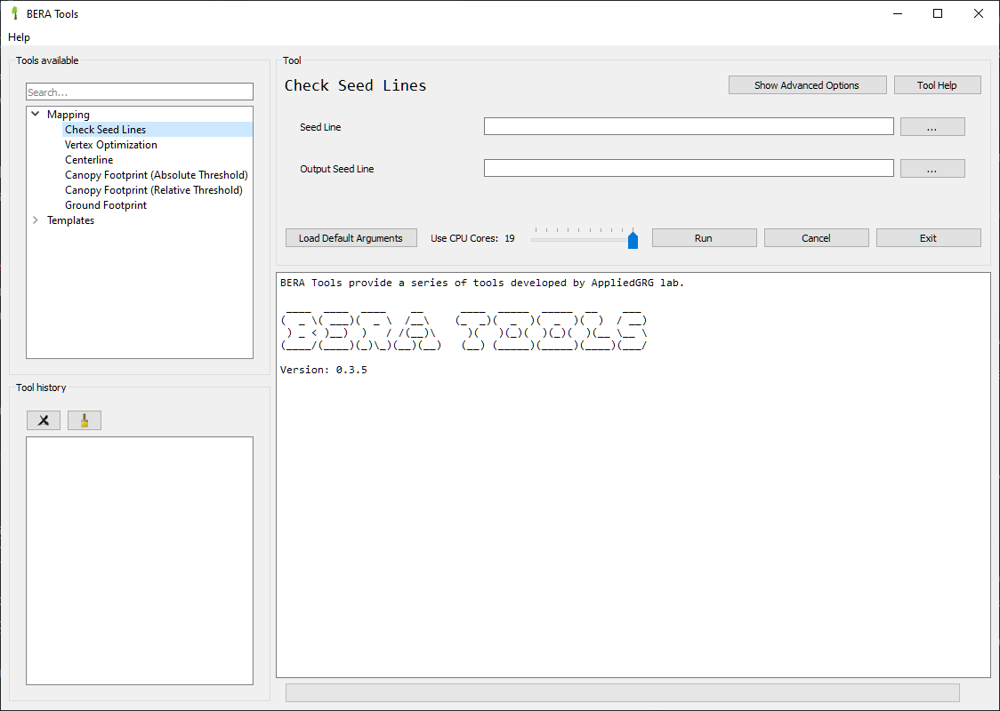

# BERA Tools

BERA Tools is successor of [Forest Line Mapper](https://github.com/appliedgrg/flm). It is a toolset for enhanced delineation and attribution of linear disturbances in forests.

<div align="center">

[](https://github.com/appliedgrg/beratools/actions/workflows/python-tests.yml)
[](https://codecov.io/gh/appliedgrg/beratools)
[](https://appliedgrg.github.io/beratools/)
[](https://anaconda.org/AppliedGRG/beratools)
[](https://pypi.org/project/BERATools/)
[](https://www.python.org/downloads/release/python-3100/)
[](https://www.gnu.org/licenses/gpl-3.0)

</div>

## [Quick Start](https://appliedgrg.github.io/beratools)

Here are the ways to install BERA Tools:

- Windows installer
- Install with Anaconda.

### Windows Installer

Windows installer is provided with releases. Check the [latest release](https://github.com/appliedgrg/beratools/releases/latest). Official Windows installers are signed under the BERA Tools [Code signing policy](CODE_SIGNING_POLICY.md).

### Install with Anaconda

Install with Anaconda works on Windows, macOS, and Linux.

- Install Miniconda. Download Miniconda from [Miniconda](https://docs.anaconda.com/miniconda/) and install on your machine.
- Download and save the file [environment.yml](https://raw.githubusercontent.com/appliedgrg/beratools/main/environment.yml
).
- Launch **Anaconda Prompt** and **Change directory** to where environment.yml is saved.
- Run the command to install BERA Tools.

   ```bash
   $ conda env create -n bera -f environment.yml
   ```

   After the installation is done, a new environment named **bera** is created and BERA Tools is installed within it.
- Activate the **bera** environment and launch BERA Tools main GUI:

  ```bash
  $ conda activate bera
  $ beratools gui
  ```



- [Download latest example data](https://github.com/appliedgrg/beratools/releases/latest/download/test_data.zip) to try with BERA Tools.

For more information about installation, check the [BERA Tools Installation](https://appliedgrg.github.io/beratools/user/installation/).

## BERA Tools Guide

Check the online [BERA Tools Guide](https://appliedgrg.github.io/beratools/) for user, developer and technical guides.

## Sponsors

<table>
  <tr>
    <td align="center">
      <a href="https://about.signpath.io/">
        
      </a>
    </td>
    <td>
      Free code signing on Windows provided by <a href="https://about.signpath.io/">SignPath.io</a>, certificate by <a href="https://signpath.org/">SignPath Foundation</a>.
    </td>
  </tr>
</table>

## Credits

<table>
  <tr>
    <td></td>
    <td>
      <p>
        This tool is part of the <strong><a href="http://www.beraproject.org/">Boreal Ecosystem Recovery & Assessment (BERA)</a></strong>.
        It is actively developed by the <a href="https://www.appliedgrg.ca/"><strong>Applied Geospatial Research Group</strong></a>.
      </p>
      <p>
        © 2026 Applied Geospatial Research Group. All rights reserved.
      </p>
    </td>
  </tr>
</table>
