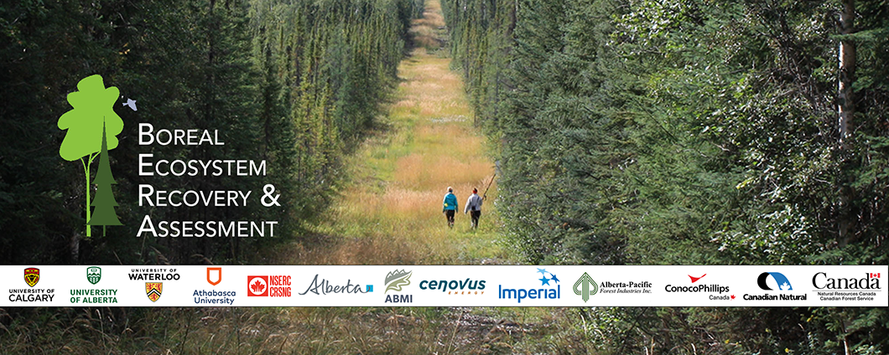

# About

BERA Tools is a series of script tools for facilitating the high-resolution mapping and studying of forest lines (petroleum exploration corridors in forested areas) via processing canopy height models (LiDAR or photogrammetry derived raster images where pixel-values represent the ground-height of vegetation).

## Motivation

Given that the process of manually digitizing detailed small-scale
(boreal) forest lines is slow and prone to human error, a semi-automated
solution is preferred for large-scale application areas. Additionally,
high-resolution CHMs allow for improved forest line spatial analysis.

## Credit

This tool is part of the [**Boreal Ecosystem Recovery and Assessment (BERA)**](http://www.beraproject.org/) Project, and is being actively developed by the [**Applied Geospatial Research Group**](https://www.appliedgrg.ca/).

### Cite Us

If you use BERA Tools for a publication, please cite it as:

    @misc{BERA Tools,
      author = "Applied Geospatial Research Group",
      title = "Forest Line Mapper",
      howpublished = "\url{https://github.com/appliedgrg/BERATools}",
    }

## Credits

This tool is part of the Boreal Ecosystem Recovery and Assessment (BERA)
Project, and was developed by the Applied Geospatial Research Group.

## Reference

The Forest Line Mapper: A Semi-Automated Tool for Mapping Linear Disturbances in Forests,
Gustavo Lopes Queiroz, Gregory J. McDermid, Mir Mustafizur Rahman, and Julia Linke. _Remote Sens._ 2020, 12(24), 4176.  
[https://doi.org/10.3390/rs12244176](https://doi.org/10.3390/rs12244176)

## License

BERA Tools is release under the GPL 3.0 (GNU General Public License
v3.0). Please refer to the LICENSE file contained in the source for
complete license description.

*Copyright (C) 2026  Applied Geospatial Research Group*