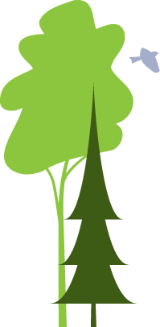

# About

This tool is part of the [**Boreal Ecosystem Recovery and Assessment (BERA)**](http://www.beraproject.org/) Project, and is being actively developed by the [**Applied Geospatial Research Group**](https://www.appliedgrg.ca/).

{.center-image}

*Copyright (C) 2026  Applied Geospatial Research Group*