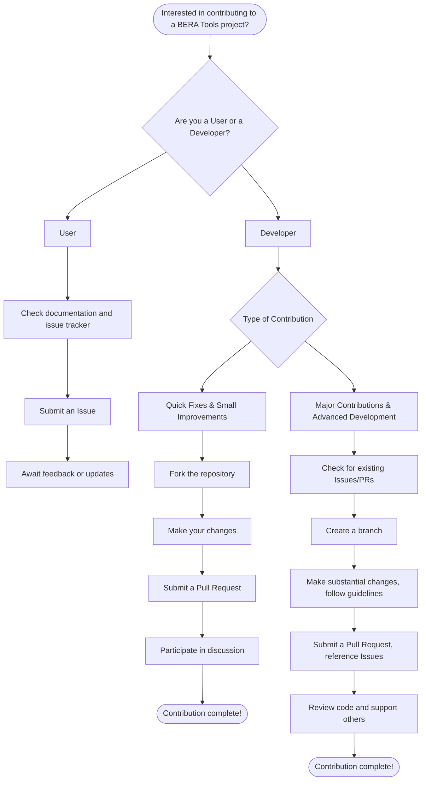

# Contributing

Thank you for your interest in improving BERA Tools. Whether you are a user, a new developer, or an experienced contributor, your involvement is highly valued. This guide will help you find the best way to participate.

## BERA Tools Contribution Flowchart

## For Non-developers

### Reporting Bugs :material-bug:

We appreciate your help in making BERA Tools better! If you encounter a bug or have a suggestion, please:

1. **Review the documentation** and **search the issue tracker** to see if your question or issue has already been addressed.

2. When submitting a new issue, include as much detail as possible:
    - BERA Tools version
    - Operating system
    - Python version
    - Any error messages from the console
    - A clear description of the problem
    - Steps or examples to reproduce the issue (screenshots are welcome, but please include text/code for easy copy/paste when possible)

3. Be ready to answer follow-up questions or provide additional information if needed. Your input helps us resolve issues more quickly!

## Helping Others :material-comment-question:

If you see questions or issues from other users, feel free to share your knowledge and suggestions. Your experience can make a big difference in the community.

## Improving Documentation :material-pencil:

We strive to keep our documentation clear and helpful, but there is always room for improvement. If you notice something missing or unclear, please help us by suggesting changes or additions. See the [Development Guide](./development.md) for more information.

## For Developers

### Submitting Pull Requests :octicons-git-pull-request-24:

Pull requests are always welcome! If you would like to contribute code—whether it’s fixing bugs or adding new features—please review our [Development Guide](./development.md) for details on setting up your environment and following our process.

## Reviewing Code :material-glasses:

Participate in code reviews by providing constructive feedback and suggestions. Collaborating on code helps us maintain high quality and encourages learning and growth for everyone involved.

---

Thank you for being part of the BERA Tools community!
