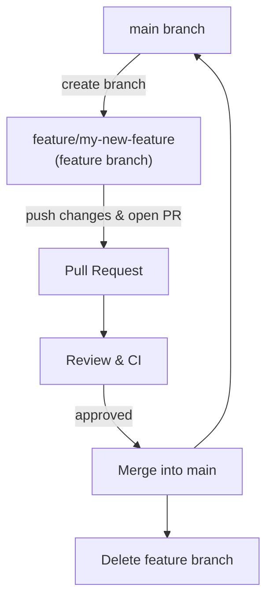

# Local Development

This document provides guidelines and instructions for setting up a local development environment for BERA Tools.

## Local Development Setup

### Using Conda

A manual conda environment setup for local development (without using environment.yml) can be done as follows:

1. Create a new environment:

   ```bash
   conda create -n bera python=3.11 -y
   conda activate bera
   ```

1. Install dependencies individually:

   ```bash
   conda install -c appliedgrg bera_centerlines
   conda install -c conda-forge dask gdal=3.9.3 geopandas pyogrio>=0.9.0 pyqt rasterio scikit-image>=0.24.0 tqdm xarray-spatial
   ```

This approach avoids installing the released beratools package and uses only the dependencies listed in [`environment.yml`](https://github.com/appliedgrg/beratools/blob/main/environment.yml).

### Using Pixi

Pixi is the easiest way to set up a consistent development environment for BERA Tools. The configuration is defined in [`pixi.toml`](https://github.com/appliedgrg/beratools/blob/main/pixi.toml).

1. **Install pixi**

    Follow the official instructions at [pixi.sh](https://pixi.sh/docs/install/) to install pixi.

1. **Create the environment**

    In the project root, run the command to setup all dependencies as specified in `pixi.toml`.

    ```bash
    git clone https://github.com/appliedgrg/beratools.git
    pixi install  # Run this command inside the beratools project root
    ```

1. **Activate the environment**

    ```bash
    pixi shell
    ```

1. **Update the environment**

    To update dependencies, re-run the `pixi install` again. Pixi will detect changes in pixi.toml and install or update packages accordingly.

    For more details, review the dependencies and tasks in [`pixi.toml`](https://github.com/appliedgrg/beratools/blob/main/pixi.toml).

### Install local code in editable mode

Activate your conda or pixi environment, then run:

   ```bash
    > git clone https://github.com/appliedgrg/beratools.git
    > cd beratools
    > pip install -e .
    > beratools  # This should start main GUI
   ```

The editable mode (`-e`) allows you to make changes to the source code and have them reflected immediately without needing to reinstall the package.

## GitHub Flow

We use a [GitHub Flow](https://docs.github.com/en/get-started/quickstart/github-flow) for development. All changes are made through feature branches and pull requests.



1. Create a new branch for your feature or bugfix:

   ```bash
   git checkout -b feature/my-new-feature
   ```

1. Make your changes and commit them with descriptive messages:

   ```bash
   git add .
   git commit -m "Add new feature X"
   ```

1. Push your branch to the remote repository:

   ```bash
   git push origin feature/my-new-feature
   ```

1. Open a pull request on GitHub and request reviews from team members.
1. Once approved, merge your changes into the main branch.
1. Delete your feature branch after merging.
1. Keep your local main branch up to date:

   ```bash
   git checkout main
   git pull origin main
   ```

## Branch Naming Conventions

- Use descriptive names for branches, prefixed by the type of work being done:
    - `feature/` for new features
    - `bugfix/` for bug fixes
    - `doc/` for documentation changes
    - `refactor/` for code refactoring
- Use hyphens to separate words (e.g., `feature/add-user-authentication`).
- Keep branch names concise yet descriptive.
- Avoid using special characters or spaces in branch names.
- Example branch names:
    - `feature/improve-performance`
    - `bugfix/fix-login-issue`
    - `doc/update-readme`
    - `refactor/optimize-database-queries`

## Short-lived Branches vs Long-lived Branches

- **Short-lived branches** are typically used for specific features or bug fixes. They are created from the main branch, worked on, and then merged back into the main branch as quickly as possible (usually within a few days or weeks). This approach helps to keep the main branch clean and reduces the risk of merge conflicts.

- **Long-lived branches**, on the other hand, are used for larger features or ongoing work that may take longer to complete. These branches may exist for weeks or months and are regularly synced with the main branch to keep them up to date. While they allow for more extensive changes, they also carry a higher risk of merge conflicts and may require more effort to integrate back into the main branch.
    - When using long-lived branches, it's important to regularly pull changes from the main branch to minimize conflicts.
    - Consider breaking down large features into smaller, manageable tasks that can be completed in short-lived branches and then merged into the long-lived branch.
    - Communicate with your team about the status of long-lived branches to ensure everyone is aware of ongoing work and potential integration challenges.

### Dealing with Merge Conflicts

- Regularly sync your branch with the main branch to minimize conflicts.
- Use descriptive commit messages to make it easier to understand changes.
- If a merge conflict occurs, carefully review the conflicting code and resolve it by choosing the appropriate changes.
- Test your code thoroughly after resolving conflicts to ensure everything works as expected.

Recommend IDEs like VSCode or PyCharm that have built-in support for Git and can help visualize and resolve merge conflicts.

## pyproject.toml

[pyproject.toml](https://github.com/appliedgrg/beratools/blob/main/pyproject.toml) is the core configuration file used to define the build system, dependencies, and other settings for BERA Tools. Other settings include Ruff, mypy, pytest, markdownlint.

### pyproject.toml Functional Groups

| Group                      | Purpose/Functionality                                                                 |
|---------------------------|---------------------------------------------------------------------------------------|
| Build System              | **[build-system]**: build backend and build-time dependencies (e.g., build-backend, requires). |
| Metadata & Core           | **[project]**: project identity and core settings — name, version, description, authors, license, requires-python, dependencies, classifiers, keywords. |
| Optional Dependencies     | **[project.optional-dependencies]**: extras grouped for development, documentation, testing, etc. |
| Entry Points / Scripts    | **[project.scripts]**: CLI entry points mapping console commands to callables.            |
| Project URLs              | **[project.urls]**: homepage, repository, issue tracker, documentation, changelog links. |
| Versioning & Build        | **[tool.hatch.version]**, **[tool.hatch.version.raw-options]**, **[tool.hatch.build.targets.sdist]**: version strategy and build-target customization. |
| Linting & Formatting Tools| **[tool.ruff]**, **[tool.markdownlint]**: code and markdown linting/formatting configurations. |
| Type Checking             | **[tool.mypy]**: static type-checker configuration and strictness options.               |
| Testing & Coverage        | **[tool.coverage.run]**, **[tool.coverage.report]**, **[tool.pytest.ini_options]**: test runner and coverage reporting settings. |