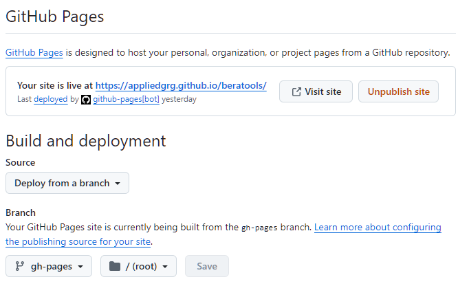

# Documentation

BERA Tools uses [Zensical](https://zensical.org/) for user, developer, and API documentation. The documentation source files are written in Markdown and are located in the `docs/` folder of the GitHub repository. Zensical reads the existing `mkdocs.yml` through its supported compatibility layer; use the `zensical` CLI rather than invoking `mkdocs` directly.

## Documentation File Structure

```bash
docs/
├── files/                  # Main documentation folder
│   ├── api.md              # API reference
│   ├── developer_guide.md  # Developer guide
│   ├── index.md            # Documentation homepage
│   ├── overview.md         # Project overview
│   ├── requirements.txt    # Python requirements for Zensical
│   ├── user_guide.md       # User guide
│   │
│   ├── css/                # Custom CSS for docs
│   ├── developer/          # Developer-specific docs
│   ├── icons/              # Project and documentation icons
│   ├── screenshots/        # Screenshots for guides and docs
│   ├── user/               # User-specific documentation
├── mkdocs.yml              # Zensical-compatible configuration file
```

## Contribution Guidelines

To contribute to the documentation, please follow these guidelines:

1. **Clarity**: Write clear and concise documentation.
2. **Structure**: Organize content logically. Use headings, subheadings, and bullet points for easy navigation.
3. **Examples**: Provide examples to illustrate complex concepts. Code snippets should be tested and functional.
4. **Updates**: Keep documentation up-to-date with the latest changes in the codebase.
5. **Review Process**: All documentation changes should be submitted as pull requests like code changes.

By following these guidelines, you can help ensure that BERA Tools documentation remains a valuable resource for all users.

## Developing Documentation Locally

Activate the development environment described in the [local development setup](development.md#local-development-setup), then run these commands from the repository root.

1. Install the required dependencies from the repository root:

   ```console
   python -m pip install -r docs/files/requirements.txt
   ```

   Alternatively, install the documentation extra from `pyproject.toml`:

   ```console
   python -m pip install ".[doc]"
   ```

2. Serve the documentation locally. This starts a development server that automatically rebuilds when files change:

   ```console
   zensical serve -f docs/mkdocs.yml
   ```

   Open `http://127.0.0.1:8000` to preview the site.

3. Build the documentation. This generates the static site in `docs/site/`:

   ```console
   zensical build -f docs/mkdocs.yml
   ```

## Deployment

The documentation is automatically validated and deployed to GitHub Pages using `.github/workflows/mkdocs-gh-pages.yml`.

Pull requests that change documentation inputs run a Zensical build without deploying. Matching pushes to `main` build `docs/site`, upload it as a GitHub Pages artifact, and deploy it with GitHub's Pages action. The published site is available at `https://appliedgrg.github.io/beratools/`.


