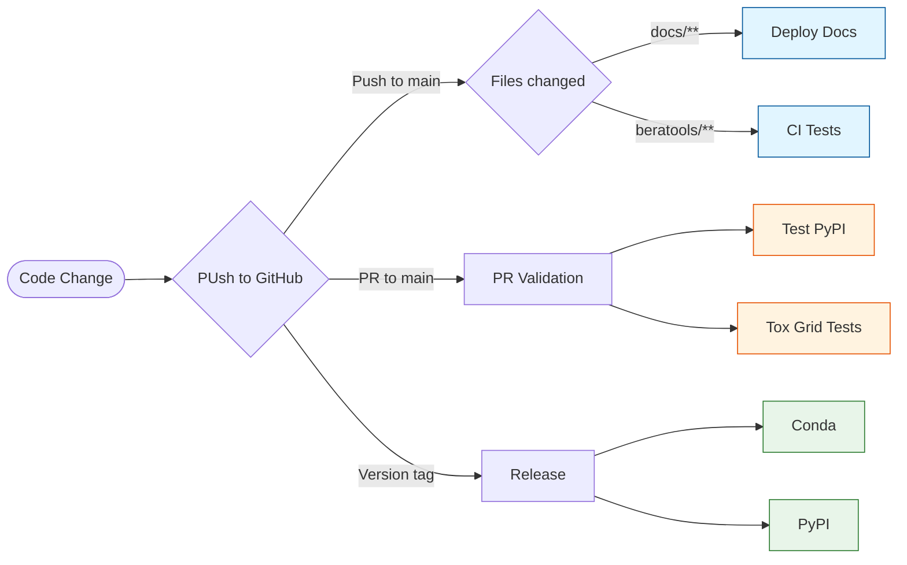

# GitHub

## Protect Branches

branch protection rules help you enforce certain workflows in your repository. You can use them to:

- Apply protection to main branch
- Require pull requests before merging
- Require 1 approving review
- Require status checks (CI) to pass before merge
- Dismiss stale approvals when new commits are pushed
- Prevent force pushes and branch deletion (restrict to admins)
- Limit merge types (e.g., enable only squash merges to keep history clean)

## Actions

GitHub Actions allow you to automate workflows directly in your repository.
BERA Tools uses GitHub Actions for CI/CD pipelines, including:

Here is a summary of the actions defined in all workflow files in `.github/workflows`, grouped by trigger type:

### Push to main

- __mkdocs-gh-pages.yml__
    - Summary: Documentation deployment workflow that builds and publishes docs on changes to `docs/**`.
    - Trigger: On push to `main` affecting `docs/**`.
    - Deploys MkDocs documentation to GitHub Pages.

### Pull request to main

- __python-tests.yml__
    - Summary: CI test and coverage workflow using Pixi and pytest that reports to Codecov.
    - Trigger: On push or pull request to `main` affecting `beratools/**`.
    - Runs pytest with coverage and uploads results to Codecov.

- __publish_to_pypi_test.yml__
    - Summary: Pre-merge PyPI test deployment to validate package publishing on PRs.
    - Trigger: On pull request to `main`.
    - Builds the package and publishes to TestPyPI.

- __tox.yml__
    - Summary: Matrix testing via tox for multiple Python versions (3.10–3.13).
    - Trigger: On pull request to `main` affecting `beratools/**`.
    - Executes tox across multiple Python versions (matrix) to run tests for each target interpreter.

### Version tag push

- __publish_to_anaconda.yml__
    - Summary: Conda packaging and release workflow that publishes packages and attaches test data to Releases.
    - Trigger: On version tag push from `main`.
    - Uses Pixi and rattler-build to build Conda packages, collects build artifacts, uploads them to Anaconda.org, and zips test data to attach to a GitHub Release.

- __publish_to_pypi.yml__
    - Summary: Official PyPI publish workflow for tagged releases.
    - Trigger: On version tag push from `main`.
    - Builds the package and publishes to PyPI.

### Actions Flow

## Discussions
