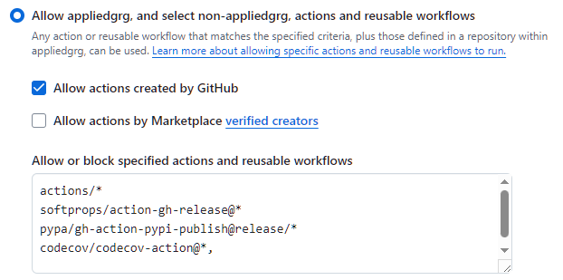
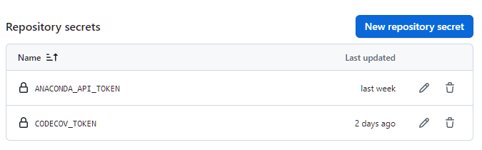
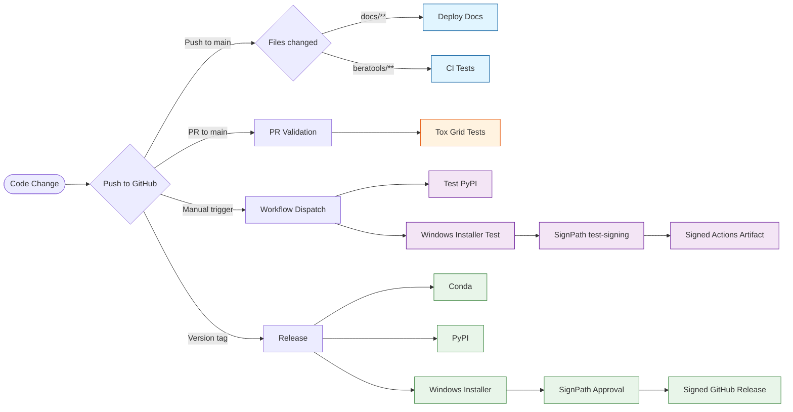
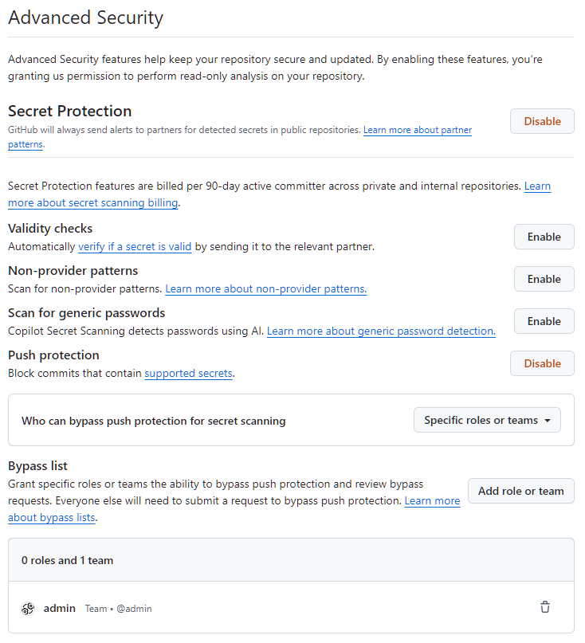
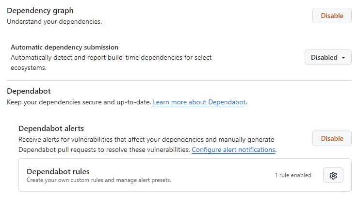
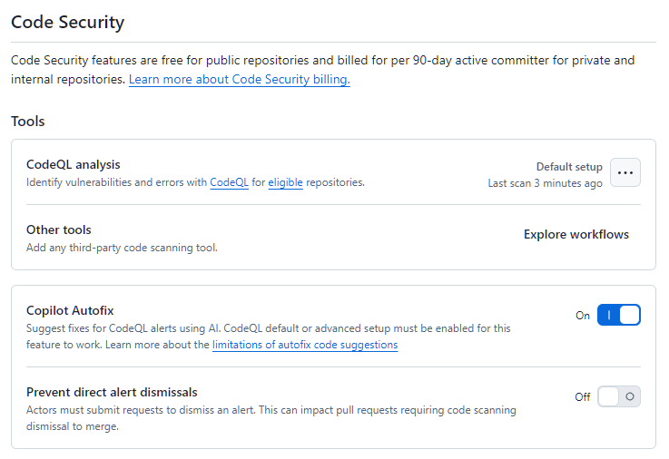

# Repository Maintainers

This document outlines the best practices and guidelines for maintainers of the BERA Tools repository on GitHub. It covers:

- branch protection
- GitHub Actions workflows
- security features
- branching strategies

Maintainers play a crucial role in ensuring the quality and security of the codebase. Following these guidelines will help
to ensure a smooth and secure development process.

## Protect Branches

branch protection rules help us enforce certain workflows in our repository. We can use them to:

- Apply protection to main branch
- Require pull requests before merging
- Require 1 approving review
- Require status checks (CI) to pass before merge
- Dismiss stale approvals when new commits are pushed
- Prevent force pushes and branch deletion (restrict to admins)
- Limit merge types (e.g., enable only squash merges to keep history clean)

## Actions

GitHub Actions allow you to automate workflows directly in our repository.
BERA Tools uses GitHub Actions for CI/CD pipelines, including:

Here is a summary of the actions defined in all workflow files in `.github/workflows`, grouped by trigger type:

### Push to main

- __mkdocs-gh-pages.yml__
    - Summary: Documentation deployment workflow that builds and publishes docs on changes to `docs/**`.
    - Trigger: On push to `main` affecting `docs/**`.
    - Deploys MkDocs documentation to GitHub Pages.

### Pull request to main

- __python-tests.yml__
    - Summary: CI test and coverage workflow using Pixi and pytest that reports to Codecov.
    - Trigger: On push or pull request to `main` affecting `beratools/**`.
    - Runs pytest with coverage and uploads results to Codecov.

- __tox.yml__
    - Summary: Matrix testing via tox for multiple Python versions (3.10–3.14).
    - Trigger: On pull request to `main` affecting `beratools/**`.
    - Executes tox across multiple Python versions (matrix) to run tests for each target interpreter.

### Manual (workflow_dispatch)

- __publish_to_pypi_test.yml__
    - Summary: Manual TestPyPI deployment to validate package publishing on demand.
    - Trigger: Manually triggered via `workflow_dispatch`.
    - Builds the package and publishes to TestPyPI.

- __build-win-installer.yml__
    - Summary: Builds the Windows installer and submits it to SignPath using `test-signing`.
    - Trigger: Manually triggered via `workflow_dispatch` on the selected branch.
    - Does not require signing approval and uploads unsigned and test-signed Actions artifacts without publishing a GitHub Release.

### Version tag push

- __publish_to_anaconda.yml__
    - Summary: Conda packaging and release workflow that publishes packages and attaches test data to Releases.
    - Trigger: On version tag push from `main`.
    - Uses Pixi and rattler-build to build Conda packages, collects build artifacts, uploads them to Anaconda.org, and zips test data to attach to a GitHub Release.

- __publish_to_pypi.yml__
    - Summary: Official PyPI publish workflow for tagged releases.
    - Trigger: On version tag push from `main`.
    - Builds the package and publishes to PyPI.

- __build-win-installer.yml__
    - Summary: Builds the Windows installer and submits it to SignPath using `release-signing`.
    - Trigger: On a version tag push whose commit is in `main`.
    - Waits for SignPath approval, verifies the formal signature, and attaches the signed installer to the GitHub Release.

See [Publishing BERA Tools](publishing.md#windows-installer-signing) for the signing and release procedure.

### Configuration

There are security measures in place to restrict actions to be used. Find these in: Repository Settings -> Actions -> General --> Actions permissions:

  

GitHub has been configured to use repository secrets for sensitive information such as API tokens and credentials required by the workflows. Find these in: Repository Settings -> Secrets and variables -> Actions --> Repository secrets:

  

Windows signing requires the `SIGNPATH_API_TOKEN` and `SIGNPATH_ORGANIZATION_ID` repository secrets. The SignPath action must also remain allowed under Repository Settings -> Actions -> General -> Actions permissions. Secret values must never be added to source control or documentation.

### Actions Flow

## Secure our repository

Our repository is using GitHub's available security features to protect our code from vulnerabilities, unauthorized access, and other potential security threats. These features include:

- Dependabot alerts notify of security vulnerabilities in BERA Tools dependency network, so that we can update the affected dependency to a more secure version.
- Secret scanning scans our repository for secrets (such as API keys and tokens) and alerts us if a secret is found, so that we can remove the secret from our repository.
- Push protection prevents we (and our collaborators) from introducing secrets to the repository in the first place, by blocking pushes containing supported secrets.
- Code scanning identifies vulnerabilities and errors in our repository's code, so that we can fix these issues early and prevent a vulnerability or error being exploited by malicious actors.

Find these settings in: Repository Settings -> Advanced Security

  

  

## Branching based workflow

To streamline collaboration, we recommend that regular collaborators work from a single repository, creating pull requests between branches instead of between repositories.

Forking is best suited for accepting contributions from people that are unaffiliated with a project, such as open-source contributors.

To maintain quality of main branch, while using a branching workflow, we use protected branches with required status checks and pull request reviews.
