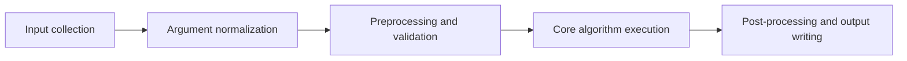

# Execution Pipeline

This page describes the high-level runtime flow from user input to final outputs.

## At a glance

## Pipeline stages

### 1) Input collection

**Purpose**

Capture tool parameters from the selected runtime interface.

**Main actions**

- GUI mode: parameters are collected from form widgets.
- CLI mode: parameters are parsed from command-line arguments.

**Inputs**

- User-provided tool parameters
- Runtime context (GUI/CLI)

**Outputs**

- Raw, mode-specific parameter payload

### 2) Argument normalization

**Purpose**

Build a consistent runtime argument set independent of call mode.

**Main actions**

- Tool metadata defines required/optional parameters.
- Framework options (`processes`, `call_mode`, `log_level`) are applied consistently.

**Inputs**

- Raw parameter payload
- Tool metadata/schema

**Outputs**

- Normalized tool kwargs ready for execution

### 3) Preprocessing and validation

**Purpose**

Verify that inputs are usable and compatible before expensive computation starts.

**Main actions**

- Read vector/raster inputs.
- Validate geometry types, CRS compatibility, and required values.

**Inputs**

- Normalized kwargs
- Source data files

**Outputs**

- Validated in-memory inputs
- Early validation errors (if any)

### 4) Core algorithm execution

**Purpose**

Run the selected tool’s core processing logic.

**Main actions**

- Tool wrapper dispatches to core modules in `beratools/core`.
- Optional multiprocessing is used for suitable workloads.

**Inputs**

- Validated inputs
- Execution options (including `processes`)

**Outputs**

- Intermediate/final computed geometries and attributes

### 5) Post-processing and output writing

**Purpose**

Finalize results and persist outputs for downstream use.

**Main actions**

- Build output geometries/attributes.
- Write result files.
- Emit logs/progress information.

**Inputs**

- Core algorithm outputs

**Outputs**

- Saved output datasets
- Runtime logs and progress signals

## Typical workflow chain

## Failure points to monitor

| Failure signal | Likely cause | Pipeline stage | Mitigation |
|---|---|---|---|
| Invalid or empty geometries in seed inputs | Corrupt source features, unintended clipping, or null geometries | Preprocessing and validation | Run seed line QA first; filter invalid/null geometries before execution |
| CRS mismatch or geographic CRS used for meter-based operations | Mixed layer CRS or unprojected data in distance/area workflows | Preprocessing and validation | Reproject all layers to a suitable projected CRS before running tools |
| Most features removed unexpectedly | Over-aggressive thresholds/filters | Core algorithm execution | Revisit parameter thresholds and test with a smaller AOI for calibration |
| Missing raster coverage for clipping/corridor steps | AOI extends beyond raster bounds or wrong raster source | Preprocessing and validation / Core algorithm execution | Verify raster extent and alignment with vector AOI before processing |

See also: [Tool Runtime Model](tool_runtime_model.md)
