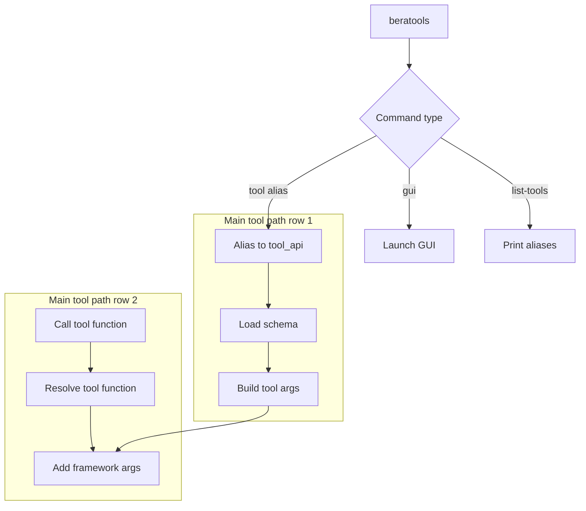

# Tool Runtime Model

This page describes how a BERA tool is executed across GUI and CLI.

## Tool API pattern

Tools generally expose a function shaped like:

```python
def tool_name(..., processes=0, call_mode=CallMode.CLI, log_level="INFO")
```

The final framework parameters are shared across tools and are used to standardize runtime behavior.

## Argument composition

`compose_tool_kwargs` reads tool metadata and creates runtime kwargs for each mode:

- **GUI mode**: tool parameters are bundled from the GUI payload.
- **CLI mode**: required/optional parameters are parsed as command-line args.
- **Module mode**: direct Python function call with explicit arguments.

This keeps tool definitions synchronized between GUI and CLI while avoiding duplicated parameter schemas.

## CLI subcommand dispatch model

The `beratools` CLI uses a unified subcommand entry point (`beratools/cli/entry.py`) and dispatches commands in three groups:

- **GUI command**: `beratools gui`
- **Utility command**: `beratools list-tools`
- **Tool commands**: short aliases (for example `check_line`, `vertex_opt`, `centerline`) mapped to internal `tool_api` names

### Dispatch flow



Node legend:

1. **Load schema**: load tool parameter metadata from `gui/assets/beratools.json`.
2. **Build tool args**: create required/optional CLI arguments from metadata.
3. **Add framework args**: append `--processes`, `--call_mode`, and `--log_level`.
4. **Resolve tool function**: map `tool_api` to function under `beratools.tools.*`.
5. **Call tool function**: execute the selected tool with parsed arguments.

### Alias and argument model

- Alias mapping is defined in `TOOL_ALIASES`.
- Tool parameter definitions (required/optional flags, defaults, choices, numeric/list typing) come from `gui/assets/beratools.json`.
- Shared runtime flags are added to every tool command:
  - `--processes`
  - `--call_mode`
  - `--log_level`

This keeps CLI behavior aligned with GUI metadata while preserving a concise command surface.

### Example commands

```bash
beratools list-tools
beratools centerline --help
beratools check_line --in_line seed_lines.gpkg --out_line qc_lines.gpkg --processes 4
```

## Multiprocessing model

For data-parallel tasks, tools can call `execute_multiprocessing` from `beratools.core.tool_base`.

Key behavior:

- Auto-detect available CPUs
- Reserve one core for system stability
- On Windows, apply conservative limits for process handle constraints
- Fall back to sequential mode when one process is used
- Keep progress/log behavior consistent with `call_mode`

## Separation of concerns

- `beratools/tools/*`: input wiring and dispatch
- `beratools/core/*`: heavy processing and algorithm implementation

This structure keeps tool wrappers small and makes algorithm logic easier to test and maintain.

See also: [How to Add a New Tool](../../developer/add_new_tool.md)
