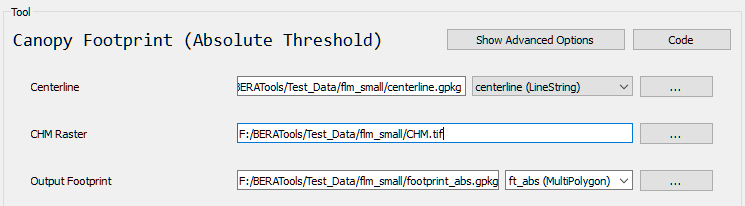

# canopy Footprint (Absolute)

## What does this tool do?

**Canopy Footprint (Absolute)** generates footprint polygons for each input line using an absolute threshold method. This is useful for mapping the area around lines (like roads or rivers) based on a canopy or cost raster, with user-defined thresholds.

## How do I use it?

### Quick Start

1. **Prepare your input files**: a centerline vector file (GeoPackage or Shapefile) and a CHM raster file.
2. **Run the tool** from GUI:

  

## What options can I set?

- **Centerline**: Path to your centerline line file
- **CHM Raster**: Path to your CHM raster file
- **Output Footprint**: Path for the output footprint file

## Tips

- Works best with line data and a canopy or cost raster.
- Adjust `corridor_thresh` and `max_ln_width` for your data and mapping needs.
