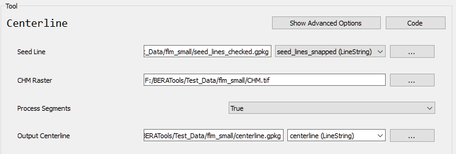

# Centerline

## What does this tool do?

**Centerline** finds the least-cost path between vertices of your input lines, helping you extract centerlines (such as for rivers or roads) based on a cost raster (e.g., a canopy height model or other surface).

## How do I use it?

### Quick Start

1. **Prepare your input files**: a line vector file (e.g., GeoPackage or Shapefile) and a raster file (e.g., canopy height model).
2. **Run the tool** from GUI:

   

3. **Open the output file** in your GIS software to see the extracted centerlines.

## What options can I set?

- **Seed Line**: Path to your input line file
- **CHM Raster**: Path to your input raster file
- **Process Segments**: Process each segment between vertices (True/False, default: True)
- **Centerline Mode**: Extraction mode (`main_route`, `pairwise`, or `virtual_nodes`, default: `main_route`)
- **Output Centerline**: Path for the output file

## Tips

- Input lines and raster must have the same spatial reference (CRS).
- Output includes centerlines and auxiliary layers (least cost path, corridor polygons).
- Works with GeoPackage or Shapefile formats.

## Guided mode details

- `main_route`: Ignores explicit endpoint guidance and extracts a centerline from the corridor graph, then applies trim and endpoint snap recovery.
- `pairwise`: Uses endpoint guidance by evaluating source/destination node pairs from the graph and selecting the best-scoring path. The final line still keeps your provided endpoints as the line terminals.
- `virtual_nodes`: Uses endpoint guidance by adding temporary virtual source/destination nodes to the graph and solving shortest paths through the augmented graph. The final line still keeps your provided endpoints as the line terminals.

Use `pairwise` when you want explicit endpoint control with direct endpoint-pair scoring. Use `virtual_nodes` when you want endpoint control with graph-augmented path search that can be more flexible in complex shapes.
