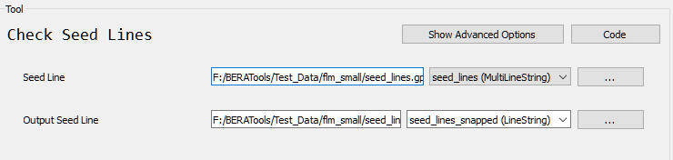

# Check Seed Lines

## What does this tool do?

**Check Seed Lines** cleans and prepares seed lines before downstream processing. It can:

- normalize multipart lines to `LineString`
- remove invalid/empty/degenerate geometries
- optionally remove short lines
- clip lines to CHM valid-data footprint (with inward shrink)
- optionally snap close endpoints (endpoint-only, directed snap)
- split lines at intersections
- optionally group lines and merge by group
- optionally densify long lines by inserting internal vertices

## How do I use it?

### Quick Start

1. **Prepare your input files**: a seed line vector file and a CHM raster file.
2. **Run the tool** from the GUI:
   

## What options can I set?

- **Seed Line**: Input seed line file
- **CHM Raster**: Input raster used to build a valid-data footprint for clipping
- **CHM footprint shrink (m)**: Inward buffer applied to the footprint before clipping (default `15`)
- **Output Seed Line**: Output seed line file
- **Remove short lines**: Enable removal of short segments
- **Minimum line length (m)**: Threshold for short-line removal (default `5`)
- **Snap close endpoints**: Enable endpoint-to-endpoint snapping only
- **Snap tolerance (m)**: Maximum endpoint snap distance (default `5`). If both short-line removal and snapping are enabled, effective tolerance is `max(snap_tolerance, minimum_line_length)`.
- **Group lines**: Enable line grouping
- **Merge by group**: Merge grouped lines (ignored when `Group lines` is off)
- **Densify long lines**: Insert equalized internal vertices on long lines
- **Max segment length (m)**: Maximum segment length for densification (default `500`)

## Tips

- Input vector and CHM raster should use the same CRS.
- Works with line data (not points or polygons).
- If clipping removes all lines, the output may be empty.
- Optional numeric parameters remain visible in the GUI; toggle logic is enforced in backend processing.
- If CHM footprint shrink is too large, processing fails with guidance to reduce the shrink distance.
