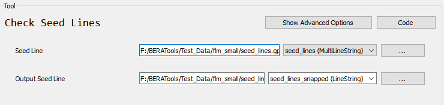

# Check Seed Line

## What does this tool do?

**Check Seed Line** helps you group and clean up seed lines. It reads your input file, merges and splits lines at intersection, and saves a new file with grouped lines—making your data clean and ready for mapping and analysis.

## How do I use it?

### Quick Start

1. **Prepare your input file** (GeoPackage, Shapefile, etc.) with seed line features.
2. **Run the tool** from the GUI:
   

## What options can I set?

- **See Line**: Path to your input file
- **Output Seed Line**: Output line layer after QC

## Tips

- Works with line data (not points or polygons).
