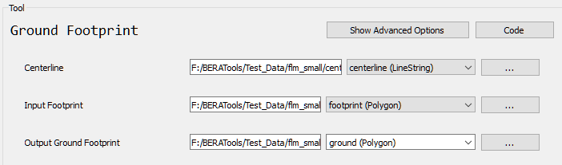

# Ground Footprint

## What does this tool do?

**Ground Footprint** creates footprint polygons for each input line using a fixed-width buffer, based on the measured width of the line features. This is useful for mapping corridors or buffered areas around lines (like roads or rivers) using a consistent width or percentile-based width.

## How do I use it?

### Quick Start

1. **Prepare your input files**: a centerline vector file (GeoPackage or Shapefile) and any type of canopy polygon footprint file.
2. **Run the tool** from GUI:

   

## What options can I set?

- **Centerline**: Path to your input line file
- **Input Footprint**: Path to your input absolute or relative canopy footprint polygon file
- **Output Footprint**: Path for the output ground footprint file

## Tips

- Use `max_width=True` to buffer using the maximum measured width (plus 20%).
- Default is to use the 75th percentile width for more