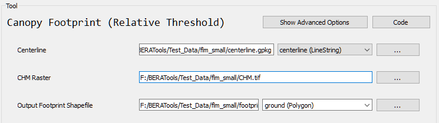

# Canopy Footprint (Relative)

## What does this tool do?

**Canopy Footprint (Relative)** creates dynamic footprint polygons for each input line using a least-cost corridor method and thresholds that are calculated individually for each line. This is useful for mapping areas around lines (like roads or rivers) where the buffer adapts to local canopy or cost raster values.

## How do I use it?

### Quick Start

1. **Prepare your input files**: a centerline vector file (GeoPackage or Shapefile) and a CHM raster.
2. **Run the tool** from GUI:

   

## What options can I set?

- **Centerline**: Path to your input centerline file
- **CHM Raster**: Path to your canopy raster file
- **Output Footprint**: Path to your output footprint file

## Tips

- This tool adapts the buffer size for each line based on local raster values.
