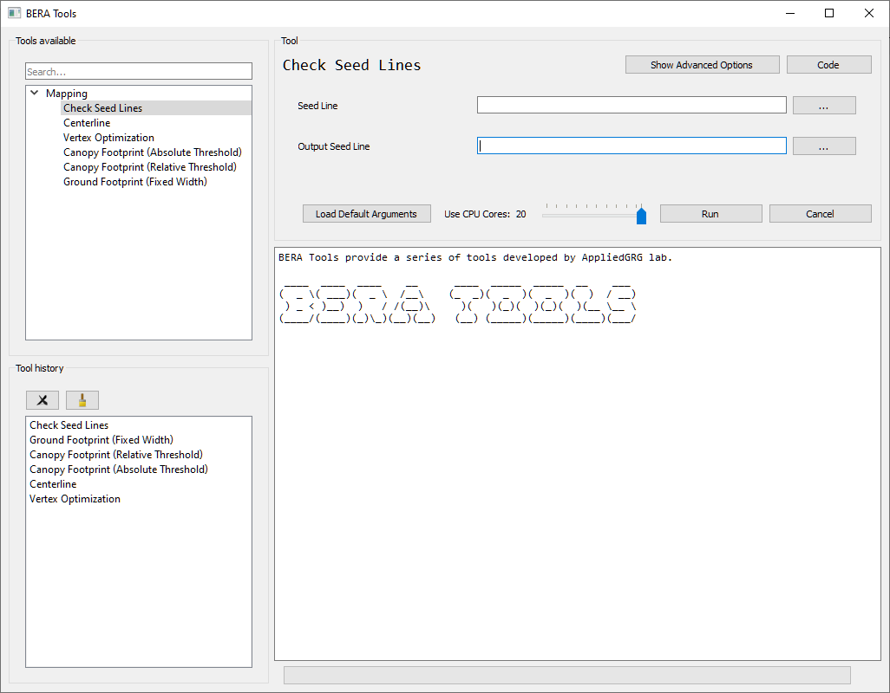
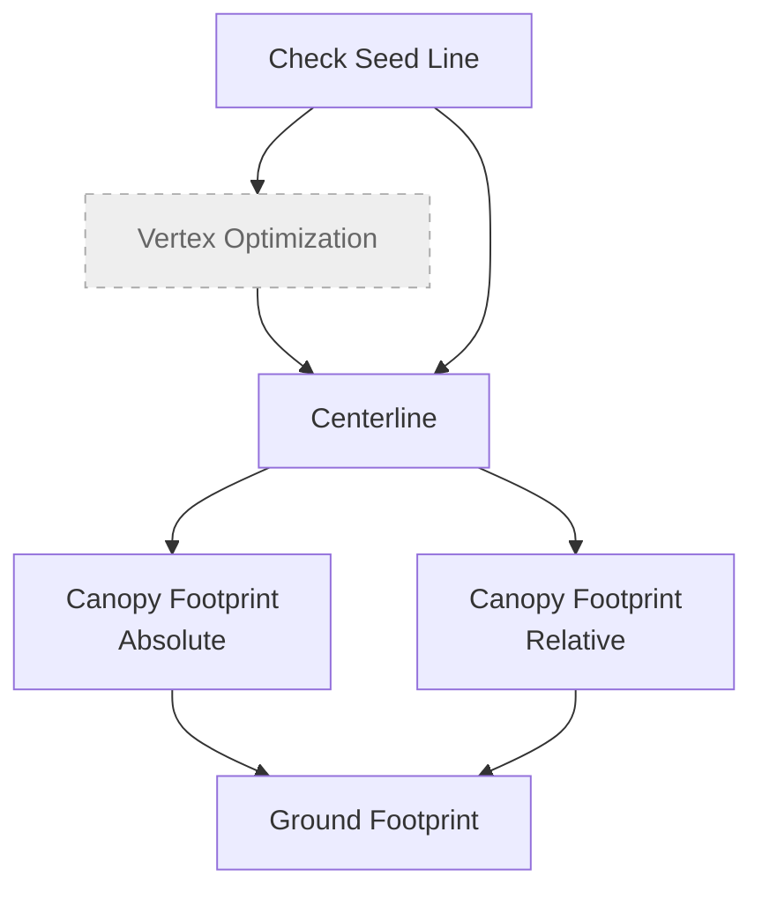

Run the command in MiniConda/Anaconda Prompt to start BERA Tools main gui.

``` bash
$ conda activate bera
$ beratools 
```

## Test Data

[Download latest example data](https://github.com/appliedgrg/beratools/releases/latest/download/test_data.zip)

## Main GUI



The BERA Tools main GUI consists of the following components:

| **Panel / Section** | **Description** |
|----------------------|-----------------|
| **Tool Selection Panel (Left)** | A tree view listing all available tools, organized by toolbox. Users can search for tools using the search bar at the top. Selecting a tool updates the main panel. |
| **Tool History Panel (Left, below tool selection)** | Displays a list of recently used tools for quick access, with options to clear or remove items. |
| **Main Panel (Right)** | **Top Section:** Shows the currently selected tool name, with buttons for advanced options, viewing code, and help.<br>**Tool Parameters:** Dynamic widgets for entering parameters required by the selected tool.<br>**Bottom Section:** Includes a slider to select the number of CPU cores, a button to load default arguments, and buttons to run or cancel the tool. |
| **Output and Progress (Bottom Right)** | A text area displays output, logs, and messages from tool execution.<br>A progress bar and label show the status of running tools. |

## Workflow Diagram


