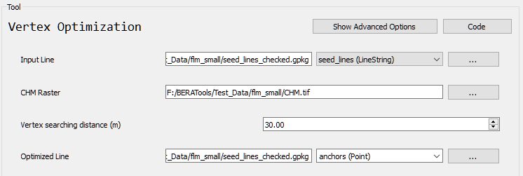

# Vertex Optimization

## What does this tool do?

**Vertex Optimization** improves the geometry of line features by optimizing the position of their vertices based on a reference raster (such as a canopy height model or cost surface). This helps to align lines more accurately with features in the raster.

## How do I use it?

### Quick Start

1. **Prepare your input files**: a seed line file (GeoPackage or Shapefile) and a CHM raster file.
2. **Run the tool** from GUI:

   

## What options can I set?

- **Input Line**: Path to your input line file 
- **CHM Raster**: Path to your input CHM raster file
- **Vertex searching distance**: Maximum distance to search for optimal vertex placement
- **Optimized Line**: Path for the output file

## Tips

- Input lines and raster must have the same spatial reference (CRS).
- QC seed lines to make best results.
