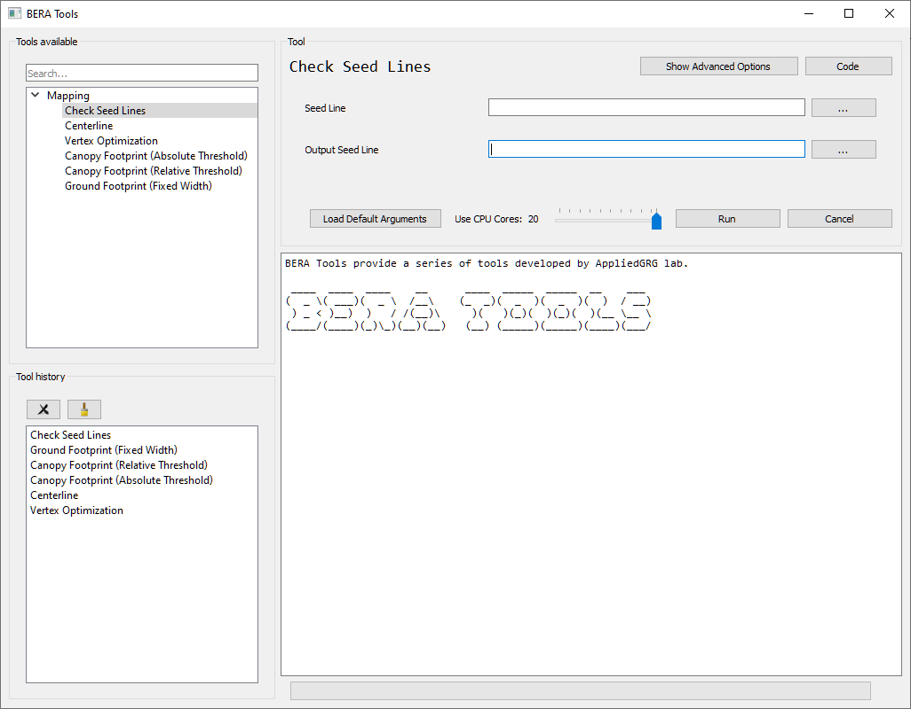
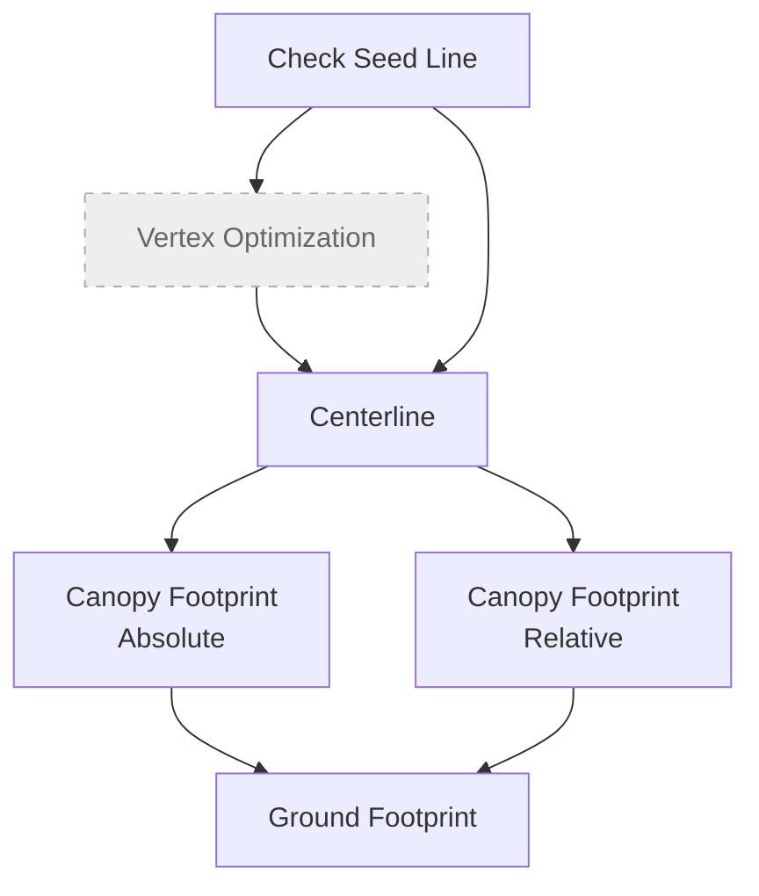

# Quick Start

Make sure [beratools is installed](user/installation.md). Run the command in MiniConda/Anaconda Prompt to start BERA Tools main gui.

``` bash
> conda activate bera
> beratools 
```

## Example Data

Start working with BERA Tools using example data.

[Download latest example data](https://github.com/appliedgrg/beratools/releases/latest/download/test_data.zip)

## Main GUI

BERA Tools provide a light weight GUI to use tools.



The BERA Tools main GUI consists of the following components:

| **Panel / Section** | **Description** |
|----------------------|-----------------|
| **Tool Selection Panel (Left)** | A tree view listing all available tools, organized by toolbox. Users can search for tools using the search bar at the top. Selecting a tool updates the main panel. |
| **Tool History Panel (Left, below tool selection)** | Displays a list of recently used tools for quick access, with options to clear or remove items. |
| **Main Panel (Right)** | **Top Section:** Shows the currently selected tool name, with buttons for advanced options, viewing code, and help.<br>**Tool Parameters:** Dynamic widgets for entering parameters required by the selected tool.<br>**Bottom Section:** Includes a slider to select the number of CPU cores, a button to load default arguments, and buttons to run or cancel the tool. |
| **Output and Progress (Bottom Right)** | A text area displays output, logs, and messages from tool execution.<br>A progress bar and label show the status of running tools. |

## Workflow Diagram



## Data Preparation

BERA Tools start with two main types of input data:

- **CHM** (GeoTIFF).
- **Seed Lines** (polylines): rough centerlines of seismic lines, which helps to detect accurate centerline.

Ensure your input data meets the following criteria:

- **Vector Format**: Supported vector formats include GeoPackage (.gpkg), Shapefile (.shp).
- **Raster Format**: Supported raster formats include GeoTIFF (.tif).
- **Coordinate System**: Data should be in a projected coordinate system (e.g., UTM) for accurate distance measurements.
